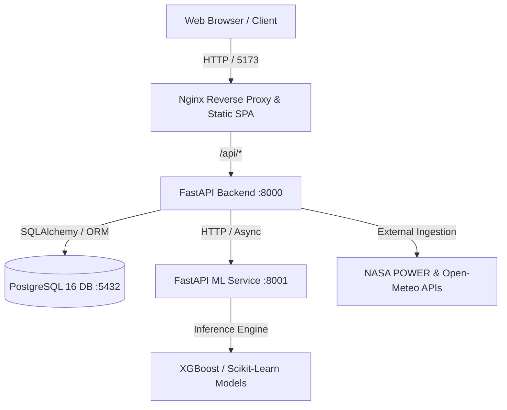

# Solar & Wind Deployment Intelligence Platform

[](https://python.org)
[](https://fastapi.tiangolo.com)
[](https://react.dev)
[](https://vitejs.dev)
[](https://postgresql.org)
[](https://docker.com)
[](https://nginx.org)
[](LICENSE)

An enterprise-grade, AI-powered renewable energy site assessment platform. It identifies optimal locations for solar, wind, and hybrid energy installations by analyzing geospatial, climatic, environmental, and infrastructure parameters through machine learning models and automated data ingestion pipelines.

---

## 🚀 Live Demo & Production Deployments

The application is deployed live across managed services on Render:

| Service | Type | Live Endpoint | Status |
|---|---|---|---|
| **Frontend Web App** | Render Static Site | [Solar & Wind Intelligence Platform](https://solar-wind-deployment-frontend.onrender.com/) | [](https://solar-wind-deployment-frontend.onrender.com/) |
| **Backend API Gateway** | Render Web Service | [solar-wind-deployment-backend.onrender.com](https://solar-wind-deployment-backend.onrender.com) | [](https://solar-wind-deployment-backend.onrender.com/health) |
| **Interactive API Docs** | Swagger UI | [solar-wind-deployment-backend.onrender.com/docs](https://solar-wind-deployment-backend.onrender.com/docs) | [](https://solar-wind-deployment-backend.onrender.com/docs) |
| **ML Inference Service** | Render Web Service | [solar-wind-deployment-platform.onrender.com](https://solar-wind-deployment-platform.onrender.com) | [](https://solar-wind-deployment-platform.onrender.com/health) |

---

## Key Features

- **AI-Powered Suitability Analysis**: Multi-variable machine learning scoring (XGBoost, Random Forest) evaluating solar irradiance, wind power density, slope, elevation, and terrain constraints.
- **Dynamic Geospatial GIS**: Interactive map viewer powered by Leaflet and OpenStreetMap with coordinate inspection, custom site radius overlays, and terrain suitability visualization.
- **Automated Climate Ingestion**: Integrated pipelines fetching historical and current meteorological data via NASA POWER and Open-Meteo APIs.
- **Smart Environmental Visibility**: Context-aware metrics display that automatically adapts to project scope:
  - *Solar Sites*: Displays solar irradiance, DNI, and peak sun hours; filters out wind metrics.
  - *Wind Sites*: Displays 10m/50m wind speed, roughness, and power density; filters out solar metrics.
  - *Hybrid Sites*: Full multi-source environmental matrix with combined yield projections.
- **Role-Based Access Control (RBAC)**: Dedicated workflows and permission-gated dashboards for Administrators, Energy Planners, GIS Analysts, and Project Managers.
- **Cross-Site Comparison Matrix**: Side-by-side site benchmarking evaluating estimated energy yield, infrastructure proximity, environmental risk, and financial feasibility.

---

## Architecture Overview



---

## Tech Stack

| Layer | Technology | Purpose |
|---|---|---|
| **Frontend** | React 19, Vite, React Router 7 | Modern Single Page Application |
| **Maps & GIS** | Leaflet.js, React-Leaflet, OpenStreetMap | Interactive spatial mapping |
| **Backend API** | Python 3.11, FastAPI, Pydantic v2 | High-performance RESTful API gateway |
| **ML Microservice** | FastAPI, Scikit-Learn, XGBoost, Joblib | Climate potential & site suitability inference |
| **Database** | PostgreSQL 16, SQLAlchemy 2.0 | Relational data persistence and site modeling |
| **Authentication**| JWT (Jose), Passlib (bcrypt), Google OAuth2 | Secure session & role-based access |
| **Reverse Proxy** | Nginx Alpine | Production SPA routing & API gateway proxy |
| **Containerization**| Docker & Docker Compose | Containerized local & cloud deployments |

---

## Prerequisites

- [Docker Desktop](https://www.docker.com/products/docker-desktop/) (recommended for containerized execution)
- [Git](https://git-scm.com/)

*(Optional: Node.js 20+ and Python 3.11+ if running standalone without Docker).*

---

## Quick Start (Docker)

### 1. Clone the Repository
```bash
git clone <repo-url>
cd solar-wind-deployment-platform
```

### 2. Configure Environment Variables
```bash
# Windows PowerShell
copy .env.example .env

# Linux / macOS
cp .env.example .env
```

Open `.env` and generate a secure `SECRET_KEY`:
```bash
python -c "import secrets; print(secrets.token_hex(32))"
```
Paste the generated hex string as `SECRET_KEY` in `.env`.

### 3. Build & Launch Services
```bash
docker compose up --build -d
```

This launches all 4 services in the background:
- **Frontend SPA**: [http://localhost:5173](http://localhost:5173)
- **Backend API & Swagger Docs**: [http://localhost:8000/docs](http://localhost:8000/docs)
- **ML Inference Service**: [http://localhost:8001/health](http://localhost:8001/health)
- **PostgreSQL Database**: `localhost:5432`

### 4. Seed Default Database (First Run)
Populate sample users, regions, projects, and environmental datasets:
```bash
docker exec solar-wind-deployment-platform-backend-1 python app/seed.py
```

---

## Default Test Accounts

Use these pre-configured credentials (generated via `seed.py`) to test role-specific dashboards:

| Role | Email | Password | Access Scope |
|---|---|---|---|
| **Administrator** | `admin@solarwind.com` | `admin123` | User roles, system configuration & analytics |
| **Energy Planner** | `planner@solarwind.com` | `planner123` | Scenario planning, project lifecycles & yields |
| **GIS Analyst** | `gis@solarwind.com` | `gis12345` | Spatial mapping, site coordinates & terrain scoring |
| **Project Manager** | `manager@solarwind.com` | `manager123` | Milestones, approvals, site status & reporting |

> **Note on Google OAuth:** Google OAuth login requires registered OAuth Client credentials (`GOOGLE_CLIENT_ID` and `GOOGLE_CLIENT_SECRET`) configured in Google Cloud Console with your authorized redirect URI. Standard email/password login works out of the box.

---

## Standalone Local Development (Without Docker)

If you prefer running services directly on your host machine for hot-reloading:

### Backend
```bash
cd backend
python -m venv venv
# Activate: .\venv\Scripts\Activate.ps1 (Windows) or source venv/bin/activate (Linux/Mac)
pip install -r requirements.txt
uvicorn app.main:app --reload --port 8000
```

### ML Microservice
```bash
cd ml-service
python -m venv venv
pip install -r requirements.txt
uvicorn app.main:app --reload --port 8001
```

### Frontend
```bash
cd frontend
npm install
npm run dev
```

---

## Cloud Deployment (Render)

This platform is configured for zero-downtime deployment on [Render](https://render.com) with the following live services:

- **Frontend (Static Site)**:
  - **Live URL**: [https://solar-wind-deployment-frontend.onrender.com/](https://solar-wind-deployment-frontend.onrender.com/)
  - **Build Command**: `npm run build`
  - **Publish Directory**: `dist`
  - **Environment Variable**: `VITE_API_URL=https://solar-wind-deployment-backend.onrender.com`
- **Backend API Gateway (Web Service)**:
  - **Live URL**: [https://solar-wind-deployment-backend.onrender.com](https://solar-wind-deployment-backend.onrender.com)
  - **Interactive Docs**: [https://solar-wind-deployment-backend.onrender.com/docs](https://solar-wind-deployment-backend.onrender.com/docs)
  - **Environment Variables**: Configure `DATABASE_URL` (Render PostgreSQL) and `ML_SERVICE_URL=https://solar-wind-deployment-platform.onrender.com`.
- **ML Inference Service (Web Service)**:
  - **Live URL**: [https://solar-wind-deployment-platform.onrender.com](https://solar-wind-deployment-platform.onrender.com)
  - **Health Endpoint**: [https://solar-wind-deployment-platform.onrender.com/health](https://solar-wind-deployment-platform.onrender.com/health)

---

## Environment Variables Reference

| Variable | Description | Default / Production Example |
|---|---|---|
| `SECRET_KEY` | JWT signature encryption secret | *Generated 64-character hex* |
| `ALGORITHM` | JWT signing algorithm | `HS256` |
| `ACCESS_TOKEN_EXPIRE_MINUTES`| Session expiration period | `30` |
| `REFRESH_TOKEN_EXPIRE_DAYS` | Refresh token duration | `7` |
| `DATABASE_URL` | PostgreSQL connection string | `postgresql://solarwind:solarwind123@db:5432/solarwind_db` |
| `ML_SERVICE_URL` | URL to ML inference API | `https://solar-wind-deployment-platform.onrender.com` (or `http://ml-service:8001` in Docker) |
| `VITE_API_URL` | Frontend API target (leave blank for local proxy)| `https://solar-wind-deployment-backend.onrender.com` |
| `GOOGLE_CLIENT_ID` | OAuth Client ID (Optional) | `placeholder.apps.googleusercontent.com` |
| `GOOGLE_CLIENT_SECRET` | OAuth Client Secret (Optional) | `placeholder_secret` |

---

## Project Structure

```
solar-wind-deployment-platform/
├── backend/
│   ├── app/
│   │   ├── core/          → Security, token verification & database dependencies
│   │   ├── models/        → SQLAlchemy ORM schemas (users, projects, sites, climate)
│   │   ├── routers/       → REST endpoints (auth, users, projects, sites, predictions)
│   │   ├── schemas/       → Pydantic validation models
│   │   ├── services/      → Geocoding, NASA POWER & Open-Meteo ingestion logic
│   │   ├── database.py    → Engine initialization and session factory
│   │   ├── main.py        → FastAPI app initialization & CORS middleware
│   │   └── seed.py        → Database seeder with sample projects and users
│   ├── requirements.txt
│   └── Dockerfile
├── ml-service/
│   ├── app/
│   │   ├── models/        → Pre-trained model binaries (.pkl, .joblib)
│   │   ├── routers/       → ML inference endpoints (/predictions)
│   │   ├── schemas/       → Input/output data schemas
│   │   ├── services/      → Solar, wind, suitability & land cover engines
│   │   └── main.py        → FastAPI ML microservice entry point
│   ├── requirements.txt
│   └── Dockerfile
├── frontend/
│   ├── src/
│   │   ├── components/    → MapView (GIS), EnvSummary, PredictionPanel, AnalyticsView
│   │   ├── pages/         → Role-based views (Planner, GIS Analyst, Manager, Admin)
│   │   ├── api.js         → Axios HTTP client & route mappings
│   │   └── App.jsx        → Router and session state manager
│   ├── nginx.conf         → Production SPA routing & /api/ reverse proxy
│   ├── vite.config.js     → Vite bundling and development proxy
│   ├── package.json
│   └── Dockerfile
├── docs/
│   ├── PROJECT_SPEC.md    → Full platform specification & domain roadmap
│   ├── DATABASE_SCHEMA.md → Relational database entities and ERD details
│   └── WORKFLOWS.md       → User personas, API contracts & permissions matrix
├── docker-compose.yml     → Multi-container orchestration specification
├── .env.example           → Sample environment configuration template
└── README.md
```

---

## Documentation Links

- Detailed Architecture & Roadmaps: [docs/PROJECT_SPEC.md](docs/PROJECT_SPEC.md)
- Entity Relationship & Schema Reference: [docs/DATABASE_SCHEMA.md](docs/DATABASE_SCHEMA.md)
- Workflows, Personas & API Specification: [docs/WORKFLOWS.md](docs/WORKFLOWS.md)

---

## License

This project is licensed under the [MIT License](LICENSE).
