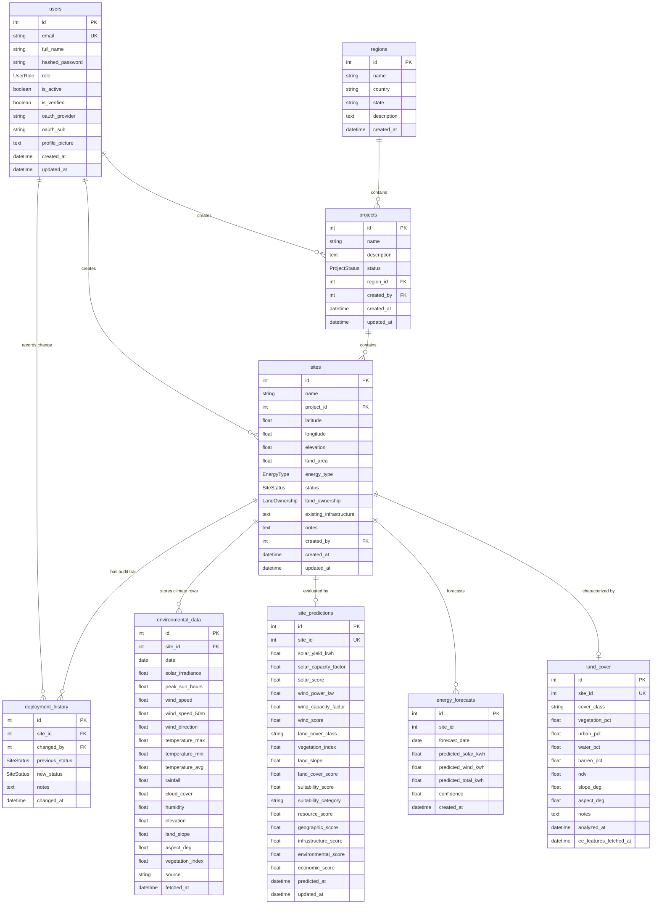

# Database Schema Specification

This document provides the verified relational database schema, entity-relationship diagrams, enum classifications, indexing strategies, and table definitions for the Solar & Wind Deployment Intelligence Platform.

---

## Table of Contents

1. [Architectural Overview](#1-architectural-overview)
2. [Entity-Relationship Diagram](#2-entity-relationship-diagram)
3. [Enum Types](#3-enum-types)
4. [Table Definitions](#4-table-definitions)
   - [users](#users)
   - [regions](#regions)
   - [projects](#projects)
   - [sites](#sites)
   - [deployment_history](#deployment_history)
   - [environmental_data](#environmental_data)
   - [site_predictions](#site_predictions)
   - [energy_forecasts](#energy_forecasts)
   - [land_cover](#land_cover)
5. [Foreign Key & Cascading Strategies](#5-foreign-key--cascading-strategies)
6. [Data Seeding & Migration Notes](#6-data-seeding--migration-notes)

---

## 1. Architectural Overview

- **RDBMS**: PostgreSQL 16
- **Object Relational Mapper (ORM)**: SQLAlchemy 2.0
- **Connection Configuration**: Loaded securely via `DATABASE_URL` in `.env`
- **Schema Initialization**: Automated via `Base.metadata.create_all()` on service boot
- **Microservice Storage Layout**:
  - *Core Backend Service*: Manages `users`, `regions`, `projects`, `sites`, `deployment_history`, and `environmental_data`.
  - *Machine Learning Service*: Manages inference and analytics tables: `site_predictions`, `energy_forecasts`, and `land_cover`.

---

## 2. Entity-Relationship Diagram



---

## 3. Enum Types

### `UserRole`
Defines role identities for authentication and RBAC authorization:
- `energy_planner`: Portfolio development, scenario design, and energy yield analysis.
- `gis_analyst`: Spatial mapping, coordinate inspections, and site asset creation.
- `project_manager`: Full lifecycle management, comparisons, and exclusive status approval authority.
- `administrator`: Security administration, user onboarding, role changes, and account deactivation.

### `ProjectStatus`
Tracks high-level project lifecycle states:
- `planning`: Initial scoping and site discovery phase (default).
- `active`: Project under active engineering or site preparation.
- `completed`: Project built, commissioned, or fully operational.
- `on_hold`: Project paused due to environmental, financial, or regulatory review.

### `EnergyType`
Specifies renewable generation technology:
- `solar`: Photovoltaic energy systems.
- `wind`: Wind turbine generators.
- `hybrid`: Co-located solar photovoltaic and wind turbine installations.

### `SiteStatus`
Tracks review and deployment lifecycle of individual sites:
- `under_review`: Candidate site undergoing environmental and ML analysis (default).
- `approved`: Formally approved for deployment by a Project Manager.
- `rejected`: Deemed unsuitable or discarded by a Project Manager.

### `LandOwnership`
Classifies legal ownership category of the site terrain:
- `government`: Public or municipal property.
- `private`: Privately owned parcels requiring lease or acquisition.
- `community`: Communal or cooperative land trusts.
- `unknown`: Unverified ownership (default).

---

## 4. Table Definitions

### `users`
Stores user identities, hashed passwords, roles, and OAuth federations.

| Column | Type | Constraints | Default | Description |
|---|---|---|---|---|
| `id` | `INTEGER` | Primary Key, Index | Autoincrement | Unique user identifier |
| `full_name` | `VARCHAR(100)` | `NOT NULL` | — | Full name of the user |
| `email` | `VARCHAR(255)` | `NOT NULL`, Unique, Index | — | Unique login email address |
| `hashed_password` | `VARCHAR(255)` | Nullable | `NULL` | Bcrypt hashed password (null for OAuth) |
| `role` | `ENUM(UserRole)` | `NOT NULL` | `'energy_planner'` | User authorization role |
| `is_active` | `BOOLEAN` | `NOT NULL` | `true` | Account active state |
| `is_verified` | `BOOLEAN` | `NOT NULL` | `false` | Email verification state |
| `oauth_provider` | `VARCHAR(50)` | Nullable | `NULL` | OAuth provider name (e.g. `'google'`) |
| `oauth_sub` | `VARCHAR(255)` | Nullable | `NULL` | Provider unique user identifier |
| `profile_picture` | `TEXT` | Nullable | `NULL` | Profile avatar URL |
| `created_at` | `TIMESTAMP` | `NOT NULL` | `utcnow()` | Registration timestamp |
| `updated_at` | `TIMESTAMP` | `NOT NULL` | `utcnow()` | Last profile update timestamp |

---

### `regions`
Stores geographic regions resolved automatically via Nominatim reverse geocoding.

| Column | Type | Constraints | Default | Description |
|---|---|---|---|---|
| `id` | `INTEGER` | Primary Key, Index | Autoincrement | Unique region identifier |
| `name` | `VARCHAR(100)` | `NOT NULL` | — | Region display name (e.g. `'California'`) |
| `country` | `VARCHAR(100)` | `NOT NULL` | — | Sovereign nation name |
| `state` | `VARCHAR(100)` | Nullable | `NULL` | State, province, or district |
| `description` | `TEXT` | Nullable | `NULL` | Optional regional notes |
| `created_at` | `TIMESTAMP` | `NOT NULL` | `utcnow()` | Creation timestamp |

---

### `projects`
Core containers for managing collections of renewable energy deployment sites.

| Column | Type | Constraints | Default | Description |
|---|---|---|---|---|
| `id` | `INTEGER` | Primary Key, Index | Autoincrement | Unique project identifier |
| `name` | `VARCHAR(150)` | `NOT NULL` | — | Project title |
| `description` | `TEXT` | Nullable | `NULL` | Project scope and objectives |
| `status` | `ENUM(ProjectStatus)` | `NOT NULL` | `'planning'` | Lifecycle status |
| `region_id` | `INTEGER` | Foreign Key (`regions.id`), Nullable | `NULL` | Linked geographic region |
| `created_by` | `INTEGER` | Foreign Key (`users.id`), `NOT NULL` | — | User ID of creator |
| `created_at` | `TIMESTAMP` | `NOT NULL` | `utcnow()` | Creation timestamp |
| `updated_at` | `TIMESTAMP` | `NOT NULL` | `utcnow()` | Last modified timestamp |

---

### `sites`
Individual solar, wind, or hybrid deployment sites evaluated within projects.

| Column | Type | Constraints | Default | Description |
|---|---|---|---|---|
| `id` | `INTEGER` | Primary Key, Index | Autoincrement | Unique site identifier |
| `name` | `VARCHAR(150)` | `NOT NULL` | — | Site display name |
| `project_id` | `INTEGER` | Foreign Key (`projects.id`), `NOT NULL` | — | Parent project container |
| `latitude` | `FLOAT` | `NOT NULL` | — | Latitude coordinate (-90 to 90) |
| `longitude` | `FLOAT` | `NOT NULL` | — | Longitude coordinate (-180 to 180) |
| `elevation` | `FLOAT` | Nullable | `NULL` | Elevation in meters (OpenTopoData) |
| `land_area` | `FLOAT` | Nullable | `NULL` | Land area in hectares |
| `energy_type` | `ENUM(EnergyType)` | `NOT NULL` | — | `'solar'`, `'wind'`, or `'hybrid'` |
| `status` | `ENUM(SiteStatus)` | `NOT NULL` | `'under_review'`| Approval state |
| `land_ownership`| `ENUM(LandOwnership)`| `NOT NULL` | `'unknown'` | Parcel ownership status |
| `existing_infrastructure`| `TEXT` | Nullable | `NULL` | Proximity to grid, roads, substations |
| `notes` | `TEXT` | Nullable | `NULL` | Technical or environmental notes |
| `created_by` | `INTEGER` | Foreign Key (`users.id`), `NOT NULL` | — | User ID of creator |
| `created_at` | `TIMESTAMP` | `NOT NULL` | `utcnow()` | Ingestion timestamp |
| `updated_at` | `TIMESTAMP` | `NOT NULL` | `utcnow()` | Last update timestamp |

---

### `deployment_history`
Chronological audit log tracking every site status modification.

| Column | Type | Constraints | Default | Description |
|---|---|---|---|---|
| `id` | `INTEGER` | Primary Key, Index | Autoincrement | Unique audit record identifier |
| `site_id` | `INTEGER` | Foreign Key (`sites.id`), `NOT NULL` | — | Target site |
| `changed_by` | `INTEGER` | Foreign Key (`users.id`), `NOT NULL` | — | Project Manager who made the decision |
| `previous_status`| `ENUM(SiteStatus)`| Nullable | `NULL` | Status prior to transition |
| `new_status` | `ENUM(SiteStatus)` | `NOT NULL` | — | Newly assigned status |
| `notes` | `TEXT` | Nullable | `NULL` | Review comments and rationale |
| `changed_at` | `TIMESTAMP` | `NOT NULL` | `utcnow()` | Timestamp of the review action |

---

### `environmental_data`
Daily historical and current meteorological observations retrieved from NASA POWER and Open-Meteo.

| Column | Type | Constraints | Default | Description |
|---|---|---|---|---|
| `id` | `INTEGER` | Primary Key, Index | Autoincrement | Unique observation identifier |
| `site_id` | `INTEGER` | Foreign Key (`sites.id`), `NOT NULL`, Index | — | Target site |
| `date` | `DATE` | `NOT NULL`, Index | — | Date of meteorological record |
| `solar_irradiance`| `FLOAT` | Nullable | `NULL` | Global Horizontal Irradiance ($W/m^2$) |
| `peak_sun_hours` | `FLOAT` | Nullable | `NULL` | Peak sun hours per day |
| `wind_speed` | `FLOAT` | Nullable | `NULL` | Wind speed at 10m ($m/s$) |
| `wind_speed_50m` | `FLOAT` | Nullable | `NULL` | Wind speed at 50m ($m/s$) |
| `wind_direction` | `FLOAT` | Nullable | `NULL` | Wind direction in degrees (0-360) |
| `temperature_max`| `FLOAT` | Nullable | `NULL` | Daily maximum temperature (°C) |
| `temperature_min`| `FLOAT` | Nullable | `NULL` | Daily minimum temperature (°C) |
| `temperature_avg`| `FLOAT` | Nullable | `NULL` | Daily average temperature (°C) |
| `rainfall` | `FLOAT` | Nullable | `NULL` | Daily precipitation total ($mm$) |
| `cloud_cover` | `FLOAT` | Nullable | `NULL` | Cloud coverage percentage (0-100%) |
| `humidity` | `FLOAT` | Nullable | `NULL` | Relative humidity percentage |
| `elevation` | `FLOAT` | Nullable | `NULL` | Digital elevation in meters |
| `land_slope` | `FLOAT` | Nullable | `NULL` | Terrain slope angle in degrees |
| `aspect_deg` | `FLOAT` | Nullable | `NULL` | Terrain orientation (0-360°, 180° = South) |
| `vegetation_index`| `FLOAT` | Nullable | `NULL` | NDVI index (-1.0 to +1.0) |
| `source` | `VARCHAR(50)` | Nullable | `NULL` | Source origin (`'nasa_power'`, `'open_meteo'`) |
| `fetched_at` | `TIMESTAMP` | `NOT NULL` | `utcnow()` | Timestamp when data was harvested |

---

### `site_predictions`
Precomputed machine learning inferences, resource scores, and multi-factor suitability ratings.

| Column | Type | Constraints | Default | Description |
|---|---|---|---|---|
| `id` | `INTEGER` | Primary Key, Index | Autoincrement | Unique prediction record ID |
| `site_id` | `INTEGER` | `NOT NULL`, Unique, Index | — | Associated site ID |
| `solar_yield_kwh`| `FLOAT` | Nullable | `NULL` | Estimated daily solar energy yield ($kWh$) |
| `solar_capacity_factor`| `FLOAT` | Nullable | `NULL` | Projected solar capacity factor (0.0 - 1.0) |
| `solar_score` | `FLOAT` | Nullable | `NULL` | Normalized solar resource score (0 - 100) |
| `wind_power_kw` | `FLOAT` | Nullable | `NULL` | Estimated wind power production ($kW$) |
| `wind_capacity_factor`| `FLOAT` | Nullable | `NULL` | Projected wind capacity factor (0.0 - 1.0) |
| `wind_score` | `FLOAT` | Nullable | `NULL` | Normalized wind resource score (0 - 100) |
| `land_cover_class`| `VARCHAR(50)`| Nullable | `NULL` | Dominant land category |
| `vegetation_index`| `FLOAT` | Nullable | `NULL` | Surface NDVI measure |
| `land_slope` | `FLOAT` | Nullable | `NULL` | Slope angle in degrees |
| `land_cover_score`| `FLOAT`| Nullable | `NULL` | Normalized terrain feasibility score |
| `suitability_score`| `FLOAT`| Nullable | `NULL` | Weighted composite score (0 - 100) |
| `suitability_category`| `VARCHAR(50)`| Nullable| `NULL` | Qualitative rating (e.g. `'Excellent'`) |
| `resource_score`| `FLOAT` | Nullable | `NULL` | Renewable resource sub-score (35% weight) |
| `geographic_score`| `FLOAT`| Nullable | `NULL` | Terrain & slope sub-score (25% weight) |
| `infrastructure_score`| `FLOAT`| Nullable | `NULL` | Grid proximity sub-score (15% weight) |
| `environmental_score`| `FLOAT`| Nullable | `NULL` | Environmental risk sub-score (15% weight)|
| `economic_score`| `FLOAT` | Nullable | `NULL` | Land cost & CAPEX sub-score (10% weight) |
| `predicted_at` | `TIMESTAMP` | `NOT NULL` | `utcnow()` | Initial inference timestamp |
| `updated_at` | `TIMESTAMP` | `NOT NULL` | `utcnow()` | Last model re-run timestamp |

---

### `energy_forecasts`
Stores time-series generation projections and forecasting confidence metrics.

| Column | Type | Constraints | Default | Description |
|---|---|---|---|---|
| `id` | `INTEGER` | Primary Key, Index | Autoincrement | Unique forecast record ID |
| `site_id` | `INTEGER` | `NOT NULL`, Index | — | Associated site ID |
| `forecast_date` | `DATE` | `NOT NULL` | — | Projected future generation date |
| `predicted_solar_kwh`| `FLOAT`| Nullable | `NULL` | Predicted solar production ($kWh$) |
| `predicted_wind_kwh` | `FLOAT`| Nullable | `NULL` | Predicted wind production ($kWh$) |
| `predicted_total_kwh`| `FLOAT`| Nullable | `NULL` | Combined renewable generation ($kWh$) |
| `confidence` | `FLOAT` | Nullable | `NULL` | Statistical model confidence score (0-1) |
| `created_at` | `TIMESTAMP` | `NOT NULL` | `utcnow()` | Generation timestamp |

---

### `land_cover`
Detailed land distribution percentages, terrain characteristics, and satellite imagery features.

| Column | Type | Constraints | Default | Description |
|---|---|---|---|---|
| `id` | `INTEGER` | Primary Key, Index | Autoincrement | Unique land cover ID |
| `site_id` | `INTEGER` | `NOT NULL`, Unique, Index | — | Associated site ID |
| `cover_class` | `VARCHAR(50)` | Nullable | `NULL` | Primary classification label |
| `vegetation_pct`| `FLOAT` | Nullable | `NULL` | Vegetative coverage percentage |
| `urban_pct` | `FLOAT` | Nullable | `NULL` | Built-up / urban surface percentage |
| `water_pct` | `FLOAT` | Nullable | `NULL` | Water body surface percentage |
| `barren_pct` | `FLOAT` | Nullable | `NULL` | Bare ground / desert surface percentage |
| `ndvi` | `FLOAT` | Nullable | `NULL` | Normalized Difference Vegetation Index |
| `slope_deg` | `FLOAT` | Nullable | `NULL` | Terrain inclination in degrees |
| `aspect_deg` | `FLOAT` | Nullable | `NULL` | Compass orientation in degrees |
| `notes` | `TEXT` | Nullable | `NULL` | Supplementary terrain notes |
| `analyzed_at` | `TIMESTAMP` | `NOT NULL` | `utcnow()` | Assessment timestamp |
| `ee_features_fetched_at`| `TIMESTAMP`| Nullable | `NULL` | Google Earth Engine ingestion timestamp |

---

## 5. Foreign Key & Cascading Strategies

When deleting parent records (e.g. `Site` deletion via `DELETE /sites/{id}`), the backend executes explicit cascading operations across both core and ML-service database entities:

```sql
-- Comprehensive site deletion cleanup
DELETE FROM energy_forecasts WHERE site_id = :id;
DELETE FROM site_predictions WHERE site_id = :id;
DELETE FROM land_cover WHERE site_id = :id;
DELETE FROM environmental_data WHERE site_id = :id;
DELETE FROM deployment_history WHERE site_id = :id;
DELETE FROM sites WHERE id = :id;
```

This ensures complete referential integrity across the microservice boundary.

---

## 6. Data Seeding & Migration Notes

- **Automated Seeder**: Pre-configured testing records (admin, planner, analyst, manager users, sample regions, projects, and 30-day environmental series) are generated via:
  ```bash
  docker exec solar-wind-deployment-platform-backend-1 python app/seed.py
  ```
- **Schema Upgrades**: Managed dynamically by SQLAlchemy model declarations on container startup.
