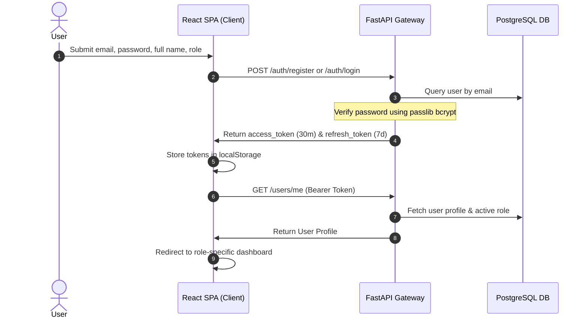
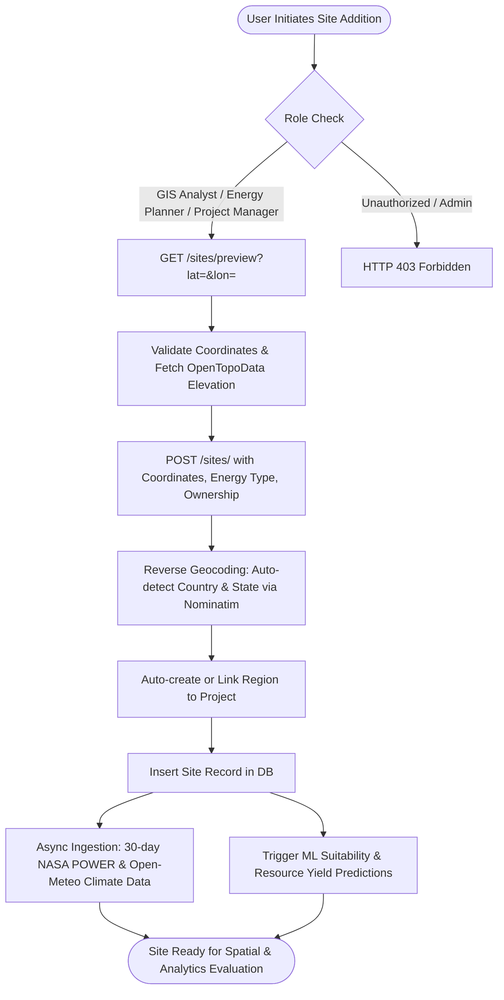
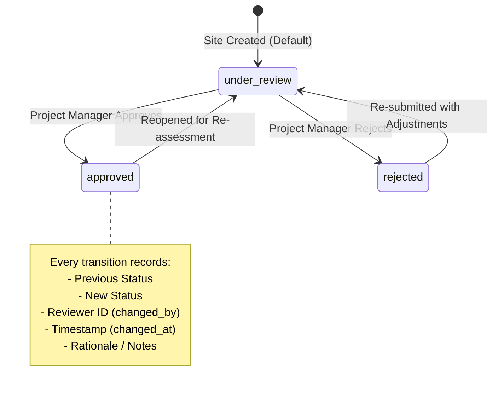
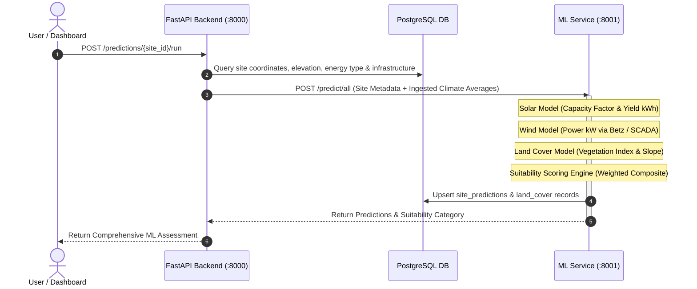

# Platform Workflows & Access Control

This document outlines the operational workflows, authentication sequences, RESTful API specifications, and role-based permissions governing the Solar & Wind Deployment Intelligence Platform.

---

## Table of Contents

1. [Authentication & Session Lifecycle](#1-authentication--session-lifecycle)
2. [Project & Site Lifecycle](#2-project--site-lifecycle)
3. [Site Status Transition & Audit Trail](#3-site-status-transition--audit-trail)
4. [Environmental Data Ingestion Pipeline](#4-environmental-data-ingestion-pipeline)
5. [Machine Learning Prediction Workflow](#5-machine-learning-prediction-workflow)
6. [API Endpoints Reference](#6-api-endpoints-reference)
7. [Role-Based Access Control (RBAC) Specification](#7-role-based-access-control-rbac-specification)

---

## 1. Authentication & Session Lifecycle

### Standard Email & Password Authentication

### Google OAuth2 Authentication

1. **Initiation**: User clicks *"Continue with Google"*. Frontend requests redirect URI via `GET /auth/google/login`.
2. **Consent**: User completes Google authentication; Google redirects to backend callback with authorization code: `GET /auth/google/callback?code=...`.
3. **Account Provisioning**: Backend exchanges authorization code with Google for profile data (name, email, Google user ID). If user does not exist, an account is automatically provisioned; if exists, Google credentials are linked.
4. **Token Delivery**: Backend issues JWT session tokens and redirects browser back to frontend with query parameters: `http://localhost:5173/?access_token=...&refresh_token=...`.
5. **Client Mount**: React reads tokens from URL search parameters, persists them in `localStorage`, cleans the browser history URL via `history.replaceState()`, and navigates to the role dashboard.

### Session Token Lifetimes
- **Access Token**: Valid for **30 minutes** (used in `Authorization: Bearer <token>` header).
- **Refresh Token**: Valid for **7 days** (used with `POST /auth/refresh` to rotate access tokens without forcing re-login).

---

## 2. Project & Site Lifecycle

1. **Project Initiation**: Created by an **Energy Planner** or **Project Manager** (name and description).
2. **Coordinate Preview**: GIS Analyst or Planner clicks on the map or inputs coordinates. `GET /sites/preview` validates latitude (-90 to 90) and longitude (-180 to 180), fetches terrain elevation, and resolves geographic boundaries.
3. **Site Registration**: `POST /sites/` saves the site under the project, auto-assigns region, and triggers background climate and ML pipelines.

---

## 3. Site Status Transition & Audit Trail

Site approval governance is strictly restricted to **Project Managers** to guarantee formal review before project commitment.

- **Endpoint**: `PATCH /sites/{site_id}/status`
- **Audit Table**: `deployment_history` (persists chronological status changes, reviewer ID, and reviewer notes).
- **Audit Retrieval**: `GET /sites/{site_id}/history` (accessible to all authenticated team members).

---

## 4. Environmental Data Ingestion Pipeline

When a site is registered or refreshed:

1. **24-Hour Cache Check**: `POST /environmental/{site_id}/collect?days=30` inspects the maximum `fetched_at` timestamp. If data was refreshed within the last 24 hours, ingestion is skipped to conserve bandwidth and prevent redundant API queries.
2. **Multi-Source Fetch**:
   - **NASA POWER API**: Daily solar irradiance ($W/m^2$), peak sun hours, direct normal irradiance (DNI), and ambient temperatures.
   - **Open-Meteo API**: Wind speed at 10m and 50m ($m/s$), wind direction, precipitation, cloud cover percentage, and relative humidity.
   - **OpenTopoData / NASA SRTM**: Digital elevation model (DEM) metrics, terrain slope, and aspect degree.
3. **Storage & Aggregation**: Raw daily observations are stored in `environmental_data`. `GET /environmental/{site_id}/summary` returns consolidated statistical means for analytical dashboards.

---

## 5. Machine Learning Prediction Workflow

---

## 6. API Endpoints Reference

### Authentication — `/auth`

| Method | Endpoint | Authorization | Description |
|---|---|---|---|
| `POST` | `/auth/register` | Public | Register new user account with default role |
| `POST` | `/auth/login` | Public | OAuth2 password form login; returns JWT tokens |
| `POST` | `/auth/refresh` | Public | Exchange refresh token for a fresh access token |
| `GET` | `/auth/google/login` | Public | Generate Google OAuth authorization URL |
| `GET` | `/auth/google/callback`| Public | Google OAuth callback handler; redirects with tokens |

### User Management — `/users`

| Method | Endpoint | Authorization | Description |
|---|---|---|---|
| `GET` | `/users/me` | Authenticated (Any) | Retrieve logged-in user profile |
| `PATCH` | `/users/me` | Authenticated (Any) | Update own user profile details |
| `GET` | `/users/` | **Administrator** | List all platform user accounts |
| `PATCH` | `/users/{id}/role` | **Administrator** | Update a user's assigned role |
| `PATCH` | `/users/{id}/deactivate`| **Administrator** | Deactivate an active user account |

### Geographic Regions — `/regions`

| Method | Endpoint | Authorization | Description |
|---|---|---|---|
| `GET` | `/regions/` | Authenticated (Any) | List all registered geographic regions |
| `POST` | `/regions/` | **Energy Planner**, **Project Manager** | Explicitly register a new region |
| `DELETE`| `/regions/{id}` | **Energy Planner**, **Project Manager** | Remove an existing region |

### Projects — `/projects`

| Method | Endpoint | Authorization | Description |
|---|---|---|---|
| `POST` | `/projects/` | **Energy Planner**, **Project Manager** | Create a new renewable project container |
| `GET` | `/projects/` | Authenticated (Any) | List all accessible projects |
| `GET` | `/projects/{id}` | Authenticated (Any) | Retrieve specific project details |
| `PATCH` | `/projects/{id}` | **Project Manager** or **Project Creator** | Modify project name, description, or status |
| `DELETE`| `/projects/{id}` | **Project Manager** or **Project Creator** | Delete project and cascade dependencies |

### Sites — `/sites`

| Method | Endpoint | Authorization | Description |
|---|---|---|---|
| `GET` | `/sites/preview?lat=&lon=` | Authenticated (Any) | Reverse geocode and fetch elevation for coordinates |
| `POST` | `/sites/` | **GIS Analyst**, **Energy Planner**, **Project Manager** | Register a site under an existing project |
| `GET` | `/sites/` | Authenticated (Any) | Query sites (filterable by `?project_id=`) |
| `GET` | `/sites/compare?ids=1,2`| Authenticated (Any) | Multi-site side-by-side comparison matrix |
| `GET` | `/sites/{id}` | Authenticated (Any) | Retrieve single site metadata |
| `PATCH` | `/sites/{id}` | **Project Manager** or **Site Creator** | Update site coordinates, land area, notes |
| `PATCH` | `/sites/{id}/status` | **Project Manager ONLY** | Transition site status (`under_review`, `approved`, `rejected`) |
| `GET` | `/sites/{id}/history`| Authenticated (Any) | Retrieve chronological deployment audit history |
| `DELETE`| `/sites/{id}` | **Project Manager** or **Site Creator** | Delete site and cascade all associated ML/climate records |

### Environmental Data — `/environmental`

| Method | Endpoint | Authorization | Description |
|---|---|---|---|
| `POST` | `/environmental/{site_id}/collect?days=30` | Authenticated (Any) | Fetch and cache 30-day meteorological data |
| `GET` | `/environmental/{site_id}` | Authenticated (Any) | Retrieve daily historical environmental rows |
| `GET` | `/environmental/{site_id}/summary` | Authenticated (Any) | Retrieve aggregated climate averages & totals |

### Predictions & Suitability — `/predictions`

| Method | Endpoint | Authorization | Description |
|---|---|---|---|
| `GET` | `/predictions/{site_id}` | Authenticated (Any) | Get precomputed ML scores and suitability rank |
| `POST` | `/predictions/{site_id}/run` | Authenticated (Any) | Trigger ML inference pipeline on the ML microservice |

---

## 7. Role-Based Access Control (RBAC) Specification

The platform implements a precise operational hierarchy reflecting real-world organizational governance.

### Backend API Permissions Matrix

| Platform Action | Energy Planner | GIS Analyst | Project Manager | Administrator |
|---|:---:|:---:|:---:|:---:|
| **Authentication & Profile** |
| Register & Login | ✅ | ✅ | ✅ | ✅ |
| View & Update Own Profile | ✅ | ✅ | ✅ | ✅ |
| **System Governance (Users)** |
| List All Users | ❌ | ❌ | ❌ | ✅ |
| Change User Roles | ❌ | ❌ | ❌ | ✅ |
| Deactivate User Accounts | ❌ | ❌ | ❌ | ✅ |
| **Project Management** |
| Create Projects | ✅ | ❌ | ✅ | ❌ |
| Edit Projects | ✅ *(Own)* | ❌ | ✅ *(Any)* | ❌ |
| Delete Projects | ✅ *(Own)* | ❌ | ✅ *(Any)* | ❌ |
| View Projects & Regions | ✅ | ✅ | ✅ | ✅ |
| Create / Delete Regions | ✅ | ❌ | ✅ | ❌ |
| **Site Operations** |
| Preview Coordinates & Elevation | ✅ | ✅ | ✅ | ✅ |
| Create Sites | ✅ | ✅ | ✅ | ❌ |
| Edit Sites | ✅ *(Own)* | ✅ *(Own)* | ✅ *(Any)* | ❌ |
| Delete Sites | ✅ *(Own)* | ❌ | ✅ *(Any)* | ❌ |
| View Sites & Compare | ✅ | ✅ | ✅ | ✅ |
| **Approval Governance** |
| Update Site Status (`approved`/`rejected`) | ❌ | ❌ | **✅ (Exclusive)** | ❌ |
| View Site Deployment History | ✅ | ✅ | ✅ | ✅ |
| **Analytics & Climate** |
| Collect Environmental Data | ✅ | ✅ | ✅ | ✅ |
| View Environmental Summaries | ✅ | ✅ | ✅ | ✅ |
| Run ML Predictions | ✅ | ✅ | ✅ | ✅ |
| View ML Predictions & Suitability | ✅ | ✅ | ✅ | ✅ |

> **Design Rationale for Administrator Role:** Administrators are dedicated to security governance, user compliance, and identity lifecycle management. Domain-level renewable project modeling, site engineering, and site approvals are partitioned to energy professionals (Planners, GIS Analysts, Project Managers) to maintain principle of least privilege (PoLP) and clean separation of duties.

---

### Frontend UI Navigation & Capabilities by Role

| Feature / UI Component | Energy Planner | GIS Analyst | Project Manager | Administrator |
|---|:---:|:---:|:---:|:---:|
| **Default Landing Page** | Projects & Sites | Map View | Projects & Sites | User Management |
| **Navigation Tabs Available** | Projects, Map, Analytics | Map, Sites, Analytics | Projects, Map, Analytics | User Management |
| **"Create Project" Action** | ✅ Visible | ❌ Hidden | ✅ Visible | ❌ Hidden |
| **"Create Site" Action** | ✅ Visible | ✅ Visible | ✅ Visible | ❌ Hidden |
| **"Delete Project" Action** | ✅ (Own projects) | ❌ Hidden | ✅ (All projects) | ❌ Hidden |
| **"Delete Site" Action** | ✅ (Own sites) | ❌ Hidden | ✅ (All sites) | ❌ Hidden |
| **Status Approval Dropdown** | ❌ Read-Only Pill | ❌ Read-Only Pill | **✅ Interactive Dropdown** | ❌ Read-Only Pill |
| **User Administration Console**| ❌ Hidden | ❌ Hidden | ❌ Hidden | **✅ Active** |
| **Interactive Map & Layers** | ✅ Interactive | ✅ Interactive | ✅ Interactive | ❌ (Access via direct URL) |
| **Run ML Prediction Button** | ✅ Active | ✅ Active | ✅ Active | ❌ |
