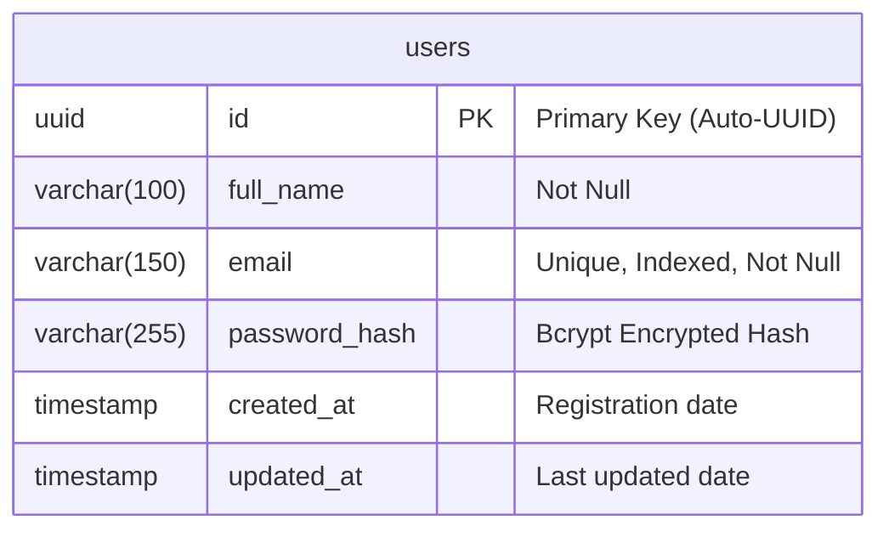
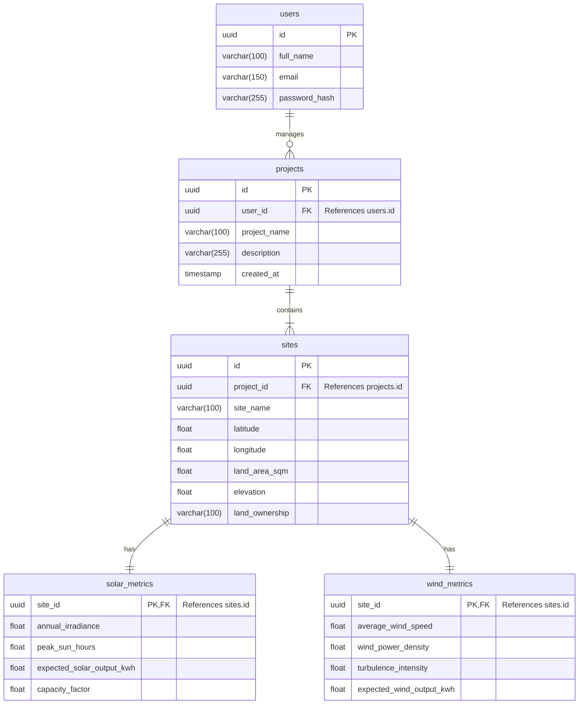

# Milestone 1 Accomplishment Report
**Project Name**: Solar & Wind Deployment Intelligence Platform  
**Target Milestone**: Milestone 1 (Week 1 & 2) — Project Initialization, Clean-Tech Design & Core Setup  

---

## 1. Executive Summary
This report summarizes the completions and technical milestones reached during the first phase of the Solar & Wind Deployment Intelligence Platform. 

We successfully initialized the full-stack architecture, connecting a **React + Vite** frontend with a **FastAPI** backend and a relational SQL database layer. In doing so, we replaced generic styling with a tailored **Clean-Tech SVG environment** that reflects the platform's focus on renewable energy and intelligent grid planning.

---

## 2. Key Achievements & Successes

### 🎨 Visual & Frontend Interface Redesign
* **Responsive SVG Animations**: Built a premium, animated clean-tech environment entirely using inline vector SVGs and pure CSS transitions. Features include:
  * **Wind Turbines**: Three distinct wind towers with rotors spinning at independent speeds (`spin-slow`, `spin-medium`, `spin-fast`).
  * **Solar Panels**: Isometric grid panels featuring a sweeping light glint to simulate solar light reflection.
  * **AI Node Network**: Pulsing green lines and intersection nodes connecting the generation structures, representing an intelligent grid.
  * **Atmosphere**: Cloud drift vectors, ambient wind particle flow streaks, and a pulsing sun core.
* **Modern Dark Glassmorphism Theme**: Updated layouts, panels, and input fields to support dark transparent slate colors (`bg-slate-900/75`), clean borders, subtle orange glows, and AAA-level text readability contrast.
* **Responsiveness & Accessibility**:
  * Visuals scale seamlessly between Desktop, Tablet, and Mobile layouts (mobile view hides background graphics to prevent input distraction).
  * Implemented `@media (prefers-reduced-motion: reduce)` support which pauses animations automatically for users with motion sensitivities.
* **Form Simplification**: Removed the "Remember session" checkbox from login forms to avoid token lifetime security risks.

### ⚡ Secure Backend API Gateway
* **Direct Bcrypt Hashing**: Replaced deprecated `passlib` password wrapper configurations with standard, raw `bcrypt` calls to resolve environment conflicts on modern Python runtimes.
* **JWT Stateless Session Management**: Developed JWT bearer token sign/verify algorithms, allowing frontend clients to maintain secure sessions in browser storage.
* **API Validation & Sanitization**: Implemented **Pydantic schemas** to reject invalid emails or passwords (minimum 6 characters), and strictly filter out private fields like `password_hash` from API responses.

### 🗄️ Relational Database & Portability
* **Automated Setup**: SQLAlchemy automatically initializes columns and schema rules on backend server startup.
* **Graceful Database Fallback**: Programmed session generators to connect to PostgreSQL on port `5432`. If the PostgreSQL server is not running during local testing, the system automatically falls back to a local SQLite database file (`backend/solar_wind_fallback.db`) to ensure zero-friction testing.
* **CLI Inspection Tool**: Created a custom console visualizer (`backend/view_db.py`) to inspect table structures and browse registered users directly inside the terminal.

---

## 3. Database ER Diagrams

### Current Entity-Relationship Model (Milestone 1)

### Future Expanded Platform Model (Milestones 2 & 3)

---

## 4. Verification Checklists & Status

* **Vite Frontend Build**: Verified (0 TS compile warnings or bundle errors).
* **API Integration Tests**: 100% Pass Rate (10/10 test flows pass successfully):
  - [x] Test User Registration Endpoint (POST `/api/auth/register`)
  - [x] Verifying database record creation
  - [x] Checking passwords hashed with bcrypt
  - [x] Confirming `password_hash` is filtered out of response
  - [x] Testing Login with valid credentials (JWT token issued)
  - [x] Rejecting invalid login attempts (HTTP 401)
  - [x] Fetching current user details (GET `/api/auth/me` with JWT)
  - [x] Blocking unauthenticated route requests
  - [x] Testing Logout endpoint responses
  - [x] Cleared client sessions on logout
